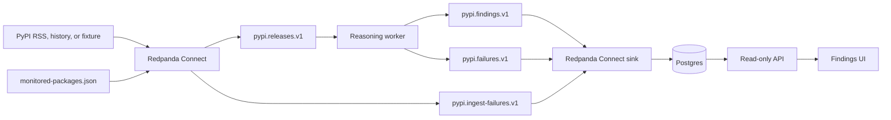

# Implementation Guide

## Product boundary

PyPI Change Intelligence turns selected PyPI releases into evidence-backed
triage findings: what changed, who could be affected, and what to verify before
adopting an update. It does not claim to know a customer's private codebase or
replace their tests.

The take-home implements one customer path:

```text
PyPI release -> Redpanda -> deterministic or model-assisted analysis
             -> Postgres -> API -> web UI
```

[`monitored-packages.json`](../config/monitored-packages.json) defines the
packages in scope.

## Architecture



Topics are durable event logs, while JSON Schemas define their record
contracts. The worker uses Redpanda's Kafka-compatible protocol for topics,
partitions, offsets, and acknowledgements.

## Record path

1. Connect reads a fixture, bounded history query, or the live PyPI RSS feed.
2. It normalizes the package name, validates the candidate, drops valid
   unmonitored releases, validates the complete event, and publishes monitored
   records to `pypi.releases.v1`.
3. The worker gathers exact current and prior-release evidence and compiles a
   normalized change set.
4. Package-neutral rules resolve supported metadata and artifact changes
   without a model call.
5. Changes needing semantic interpretation enter the model-assisted stages.
6. The worker publishes one terminal finding or failure before committing the
   source offset.
7. Connect validates and persists the result; the API provides the UI's read
   model.

Invalid RSS documents and invalid release records become bounded
`pypi.ingest-failures.v1` events. A missing or invalid monitored-package list is
a systemic configuration failure rather than permission to process the global
feed. The worker also rejects out-of-scope records as a second guard.

## Demo proof and canaries

`docker compose up --build --force-recreate` first processes banked RSS through
the real ingestion, reasoning, persistence, API, UI, and telemetry path. This
fixture phase always uses banked evidence and a fake model, so it cannot make a
paid model call.

The well-formed fixture contains 27 RSS items that exercise:

- 24 unique monitored releases;
- one duplicate release removed by ingestion deduplication;
- one valid unmonitored release removed by relevance filtering; and
- one invalid release link published as an ingestion failure.

A second malformed RSS document exercises document-level failure handling.
Before live ingestion starts, the persistence gate requires terminal attempts
for all 24 releases, both ingestion failures, and these six deterministic
canaries:

| Canary | Expected route |
| --- | --- |
| `boto3 1.40.0rc1` | Observe prerelease |
| `urllib3 2.6.1` | Deterministic non-substantive |
| `urllib3 2.6.0` | Python-floor tightening |
| `cffi 2.1.0` | Wheel-platform contraction |
| `packaging 26.2` | Python support expansion |
| `pluggy 1.6.1` | Yanked release |

The fixture source and worker then exit. The `drain-gate` requires two
consecutive zero-lag samples for the reasoning, Postgres sink, and trace-bridge
consumer groups before the public-evidence worker and live source can start.
Any failed gate prevents the live handoff and leaves retained state available
for inspection.

Live mode fetches public PyPI evidence. It defaults to the fake model; paid
model use requires both `MODEL_MODE=openai` and a non-empty `OPENAI_API_KEY`.

## Analysis paths

The deterministic router runs before any model request. It can complete:

- prerelease and unchanged-release observations;
- minimum Python-version changes;
- wheel and platform coverage changes;
- source-distribution availability changes; and
- yank and release-availability changes.

Dependency, vulnerability, partial, ambiguous, and unsupported changes retain
the model-assisted path. Findings are labeled `deterministic` or
`model_assisted` according to the decision-maker; there is no `hybrid` label.

Model assistance is a bounded three-stage pipeline, not an autonomous loop:

| Stage | Question | Output guardrail |
| --- | --- | --- |
| Materiality | Is there a substantive supported change? | Claims cite supplied evidence |
| Applicability | Under what consumer condition could it matter? | Typed trigger, outcome, evidence, and verification |
| Customer impact | What should an engineer know and do? | Concise decision copy within the evidence boundary |

Schemas, bounded evidence, sanitization, semantic validation, and at most one
targeted correction keep each stage constrained. The model cannot invent
customer inventory, incidents, affected users, or active breakage. Tokens,
latency, retries, and estimated cost are persisted; the current cost baseline
is in [Model Cost Optimization](COST_OPTIMIZATION.md).

## Delivery and failure guarantees

The worker disables automatic offset commits. It commits only after a terminal
finding or failure has been acknowledged by Redpanda.

- Retryable provider, broker, or enrichment failures remain uncommitted for
  redelivery.
- Permanent record failures produce bounded failure events so one record does
  not block a partition forever.
- Deterministic identifiers and database constraints make replay idempotent.
- Interrupted, uncommitted work is redelivered after restart.

The service provides at-least-once delivery: duplicate processing is
acceptable; silent loss is not.

See Redpanda Connect's [message delivery semantics](https://docs.redpanda.com/connect/guides/delivery_semantics/)
and [error-handling documentation](https://docs.redpanda.com/connect/configuration/error_handling/)
for the acknowledgement, redelivery, retry, and failure-routing principles
used here.

## Observability

Trace context follows a release through Connect, Redpanda, worker stages, the
sink, and the committed Postgres transaction. The local stack provides:

- OpenTelemetry traces in Tempo;
- structured logs in Loki;
- service, broker, database, consumer-lag, and model metrics in Prometheus; and
- provisioned Grafana dashboards for health, failures, model calls, and traces.

Full model payload capture is disabled by default. Only bounded metadata such
as hashes, token usage, cost, attempts, and correlation IDs is retained unless
local payload capture is explicitly enabled.

The UI, API, Grafana, and Redpanda Console bind only to `127.0.0.1`; internal
services remain on the Compose network. This is an unauthenticated local demo
and must not be exposed to a LAN.

## Drain and verification

Stop ingress and prove downstream processing has caught up:

```sh
docker compose stop --timeout 60 connect-source && \
  docker compose run --rm --no-deps drain-gate
```

The command leaves the API, UI, database, and observability services available.
If either step fails, the stack is not declared drained. After success,
`docker compose down --timeout 60 --remove-orphans` stops the stack without
deleting retained volumes.

Two local checks cover the submission boundary:

| Command | Evidence produced |
| --- | --- |
| `make smoke` | Disposable full-stack customer path, telemetry, zero lag, and cleanup |
| `make check` | Compose, quality, schemas, Connect, observability, Python, API, and web checks |

## Take-home limits

The output is evidence-backed release triage, not a guaranteed upgrade
decision. A production version would require customer profiles, authentication,
managed secrets, deployment and recovery automation, SLOs, capacity testing,
and horizontal scaling. Popularity ranking and full transitive-dependency
analysis remain stretch goals rather than requirements for this demonstration.
